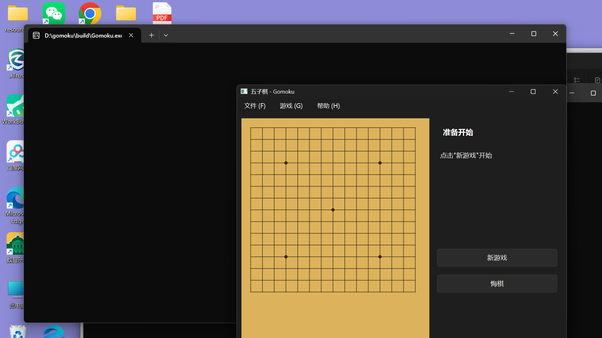

# 五子棋 (Gomoku)

一款基于 C++ Qt 开发的桌面五子棋游戏，作为《软件设计》课程项目最终产品。



## 项目简介

本项目实现了一个具有完整可视化界面的五子棋桌面应用程序，支持双人本地对战、悔棋、游戏状态显示等核心功能。程序采用面向对象设计，代码结构清晰，具有良好的可维护性和扩展性。

## 项目功能

### 核心功能
- ✅ 开始新游戏
- ✅ 双人本地对战
- ✅ 15×15 标准棋盘显示
- ✅ 黑白棋子显示
- ✅ 鼠标点击落子
- ✅ 落子合法性检查
- ✅ 回合自动切换
- ✅ 五子连珠判断（横、竖、斜四个方向）
- ✅ 胜负判断
- ✅ 游戏结束状态管理
- ✅ 重新开始游戏
- ✅ 悔棋功能
- ✅ 当前玩家显示
- ✅ 非法落子提示
- ✅ 双设备在线联机对战（TCP）

### 界面特性
- 🎨 木质纹理棋盘背景
- 🎨 逼真的黑白棋子渲染（带渐变效果）
- 🎨 最后一步落子红色标记
- 🎨 棋盘星位点显示
- 🎨 响应式窗口大小调整

## 技术栈

| 技术 | 版本 | 说明 |
|------|------|------|
| C++ | 17 | 编程语言 |
| Qt | 5.15+ / 6.x | GUI 框架 |
| CMake | 3.16+ | 构建系统 |

## 软件架构

### 面向对象设计

本项目采用分层架构设计，将游戏逻辑与 UI 逻辑完全分离：

```
┌─────────────────────────────────────┐
│           MainWindow                │  ← UI 层
│         (Qt Widgets)                │
├─────────────────────────────────────┤
│          BoardWidget                │  ← 显示层
│       (棋盘可视化控件)               │
├─────────────────────────────────────┤
│             Game                    │  ← 游戏逻辑层
│      (游戏规则与流程控制)            │
├─────────────────────────────────────┤
│             Board                   │  ← 数据层
│     (棋盘状态与落子管理)             │
└─────────────────────────────────────┘
```

### 核心类说明

| 类名 | 职责 | 所在文件 |
|------|------|----------|
| `ChessPiece` | 棋子类型枚举（黑、白、空） | `include/ChessPiece.h` |
| `GameState` | 游戏状态枚举（进行中、胜利等） | `include/ChessPiece.h` |
| `Board` | 棋盘数据管理、落子、胜负判断 | `include/Board.h`, `src/Board.cpp` |
| `Game` | 游戏流程控制、玩家切换、状态管理 | `include/Game.h`, `src/Game.cpp` |
| `BoardWidget` | 棋盘可视化绘制、鼠标事件处理 | `src/BoardWidget.h`, `src/BoardWidget.cpp` |
| `MainWindow` | 主窗口、菜单栏、控制面板 | `src/MainWindow.h`, `src/MainWindow.cpp` |
| `NetworkManager` | 联机通信（TCP + JSON 协议） | `include/NetworkManager.h`, `src/NetworkManager.cpp` |
| `GameModeDialog` | 游戏模式选择（本地 / 网络对战） | `src/GameModeDialog.h`, `src/GameModeDialog.cpp` |

### 设计原则

1. **单一职责**: 每个类只负责一个明确的职责
2. **数据与显示分离**: `Board` 类只管理数据，`BoardWidget` 类只负责显示
3. **封装**: 关键数据通过方法访问，避免直接操作
4. **回调机制**: 使用 `std::function` 实现游戏状态变化通知

## 项目目录结构

```
gomoku/
├── CMakeLists.txt          # CMake 构建配置
├── README.md               # 项目说明文档
├── PROJECT_STATE.md        # 项目状态跟踪
├── include/
│   ├── ChessPiece.h        # 棋子与游戏状态枚举
│   ├── Board.h             # 棋盘类头文件
│   ├── Game.h              # 游戏类头文件
│   └── NetworkManager.h    # 联机通信类头文件
├── src/
│   ├── main.cpp            # 程序入口
│   ├── Board.cpp           # 棋盘类实现
│   ├── Game.cpp            # 游戏类实现
│   ├── BoardWidget.h       # 棋盘控件头文件
│   ├── BoardWidget.cpp     # 棋盘控件实现
│   ├── MainWindow.h        # 主窗口头文件
│   ├── MainWindow.cpp      # 主窗口实现
│   ├── GameModeDialog.h    # 游戏模式选择头文件
│   ├── GameModeDialog.cpp  # 游戏模式选择实现
│   └── NetworkManager.cpp  # 联机通信类实现
├── resources/              # 资源文件（图标、音效等）
└── docs/                   # 文档资料
```

## 环境要求

### 必需软件

- **操作系统**: Windows 10/11, macOS 10.15+, Linux
- **C++ 编译器**: 支持 C++17 (MinGW GCC, MSVC, Clang)
- **Qt**: 5.15 或 Qt 6.x
- **CMake**: 3.16 或更高版本

### 推荐开发环境

- **Windows**: Qt Creator + MinGW 11.2.0 64-bit
- **跨平台**: Qt Creator + 系统默认编译器

## 编译方法

### 1. 克隆或下载项目

```bash
cd gomoku
```

### 2. 创建构建目录

```bash
mkdir build
cd build
```

### 3. 配置 CMake

```bash
cmake ..
```

如果 Qt 未安装在默认路径，需要指定 Qt 路径：

```bash
# Windows 示例
cmake -DCMAKE_PREFIX_PATH="C:/Qt/6.5.0/mingw_64" ..

# Linux 示例
cmake -DCMAKE_PREFIX_PATH="/opt/Qt6.5.0/gcc_64" ..
```

### 4. 编译项目

```bash
cmake --build .
```

或使用 make/ninja：

```bash
make
# 或
ninja
```

### 5. 运行程序

```bash
./Gomoku
# Windows 下为 Gomoku.exe
```

## 运行方法

### Windows
双击 `Gomoku.exe` 或在命令行运行：
```cmd
Gomoku.exe
```

### macOS
```bash
open Gomoku.app
```

### Linux
```bash
./Gomoku
```

## 双设备在线联机对战

本项目支持两台设备通过局域网（同一 WiFi）在线对战，采用 Qt TCP 套接字 + JSON 消息通信。一台设备开房间当「主机」（执黑先手），另一台设备「加入」当客户端（执白）。

### 操作流程

1. 两台设备连接**同一个 WiFi / 局域网**
2. **主机设备**：双击 `Gomoku.exe` 启动，在开始界面选择「网络对战」，点「创建房间」，记下端口号（默认 `12345`）
3. **客户端设备**：启动程序，选择「网络对战」，点「加入」，填写主机的 IP 和端口
   - 查看主机 IP：Windows 按 `Win + R` 输入 `cmd`，运行 `ipconfig`，找到「IPv4 地址」，例如 `192.168.1.100`
4. 两设备都进入棋盘后，主机（黑方）先手，轮流点击落子
5. 任一方点击「重新开始」，双方棋盘同步清空

### 注意事项

| 项目 | 说明 |
|------|------|
| 网络 | 必须同一局域网；公网联机需自行做端口映射 / 内网穿透 |
| 防火墙 | 主机需放行 TCP `12345` 端口，否则客户端连不上 |
| 端口 | 默认 `12345`，创建房间时可修改；客户端端口需与主机一致 |
| 先手 | 主机执黑先手，客户端执白后手 |
| 悔棋 | 联机对战为公平起见不开放悔棋 |
| 掉线 | 一方关闭窗口后，另一方会收到断开提示 |

### 防火墙放行端口（Windows）

1. 按 `Win + R` 输入 `wf.msc` 打开「高级安全 Windows 防火墙」
2. 点击「入站规则」→「新建规则」→「端口」
3. 选择「TCP」，特定本地端口填 `12345`
4. 选择「允许连接」→ 完成
5. 若连接失败，请先确认防火墙已放行该端口

### 通信协议（开发参考）

采用换行分隔的 JSON 文本：

| 消息 | 方向 | 含义 |
|------|------|------|
| `{"type":"HELLO","color":0}` | 客户端 → 主机 | 加入房间，0=黑，1=白 |
| `{"type":"MOVE","row":r,"col":c}` | 双向 | 落子坐标 |
| `{"type":"RESET"}` | 双向 | 重新开始 |

## 游戏操作方法

| 操作 | 方法 |
|------|------|
| 落子 | 鼠标左键点击棋盘交叉点 |
| 新游戏 | 点击右侧"新游戏"按钮 或 菜单"文件 → 新游戏" |
| 悔棋 | 点击右侧"悔棋"按钮 或 菜单"游戏 → 悔棋" |
| 退出 | 点击"文件 → 退出" 或关闭窗口 |
| 查看规则 | 点击"帮助 → 关于" |

## 游戏规则

1. **先手**: 黑方先行，双方轮流落子
2. **落子**: 棋子必须落在棋盘交叉点上
3. **胜负**: 先形成五子连珠（横、竖、斜任意方向）者获胜
4. **禁着**: 已有棋子的位置不能重复落子
5. **游戏结束**: 一方获胜后，游戏结束，需重新开始

## 测试说明

### 已测试功能

| 测试项 | 状态 | 说明 |
|--------|------|------|
| 棋盘初始化 | ✅ | 空棋盘正确显示 |
| 第一手落子 | ✅ | 黑方可以正常落子 |
| 重复位置检测 | ✅ | 阻止在已有棋子位置落子 |
| 边界位置 | ✅ | 棋盘边缘可以正常落子 |
| 横向五连判断 | ✅ | 正确识别横向五子连珠 |
| 纵向五连判断 | ✅ | 正确识别纵向五子连珠 |
| 斜向五连判断 | ✅ | 正确识别两条斜线五子连珠 |
| 六子及以上 | ✅ | 六子、七子也判定为胜利 |
| 黑白交替 | ✅ | 正确切换玩家 |
| 胜利后禁止落子 | ✅ | 游戏结束后无法继续落子 |
| 重新开始 | ✅ | 棋盘清空，黑方先行 |
| 悔棋 | ✅ | 可撤销最后一步 |
| GUI 显示 | ✅ | 窗口、棋盘、棋子正常显示 |

### 测试方法

手动测试步骤：

1. 启动程序
2. 点击"新游戏"
3. 在棋盘中央点击落子
4. 验证黑白交替
5. 尝试在已有棋子位置落子（应被阻止）
6. 形成五子连珠，验证胜负判断
7. 测试悔棋功能
8. 测试重新开始功能

## 素材来源

| 素材 | 来源 | 许可 |
|------|------|------|
| 棋盘背景色 | Qt 自行绘制 | - |
| 棋子渲染 | Qt 渐变绘制 | - |
| 图标 | Qt 内置图标 | LGPL |

本项目所有视觉元素均通过 Qt 绘图 API 实时生成，无外部图片资源依赖。

## 开发成员及分工

| 成员 | 分工 | 贡献模块 |
|------|------|----------|
| [组员姓名待填写] | 项目负责人、核心逻辑 | Game, Board |
| [组员姓名待填写] | UI 设计与实现 | MainWindow, BoardWidget |
| [组员姓名待填写] | 测试与文档 | 测试用例、README |

**注意**: 提交前请补充真实组员姓名

## 作者注释说明

本项目所有源代码文件均在开头包含作者注释，格式如下：

```cpp
// Author: [组员姓名待填写]
// Module: 模块名称
// Description: 模块功能描述
```

关键函数和复杂逻辑处也添加了必要的行内注释。

## 已知问题

| 问题 | 严重程度 | 状态 | 备注 |
|------|----------|------|------|
| 暂无严重 Bug | - | - | - |

如发现问题，请记录以下步骤：
1. 复现步骤
2. 预期行为
3. 实际行为
4. 环境信息（操作系统、Qt 版本）

## 后续可扩展方向

本项目预留了良好的扩展接口，可实现以下功能：

### 已规划功能
- [ ] AI 人机对战（简单启发式评估）
- [ ] 游戏计时器
- [ ] 棋谱保存与加载
- [ ] 棋盘主题切换
- [ ] 落子音效
- [ ] 胜利动画效果
- [ ] 游戏记录统计

### 扩展建议

1. **AI 功能**: 在 `Game` 类中添加 AI 落子方法，使用 minimax 算法或基于规则的评估
2. **网络对战**: 已通过 `NetworkManager` 实现，使用 Qt Network 模块的 TCP 通信，后续可扩展公网联机
3. **棋谱功能**: 添加 `GameRecord` 类，支持 SGF 格式导入导出

## 许可证

本项目为《软件设计》课程教学用途，代码可自由学习参考。

## 致谢

感谢《软件设计》课程提供的实践机会。

---

**最后更新**: 2026-09-04  
**项目版本**: 1.1
