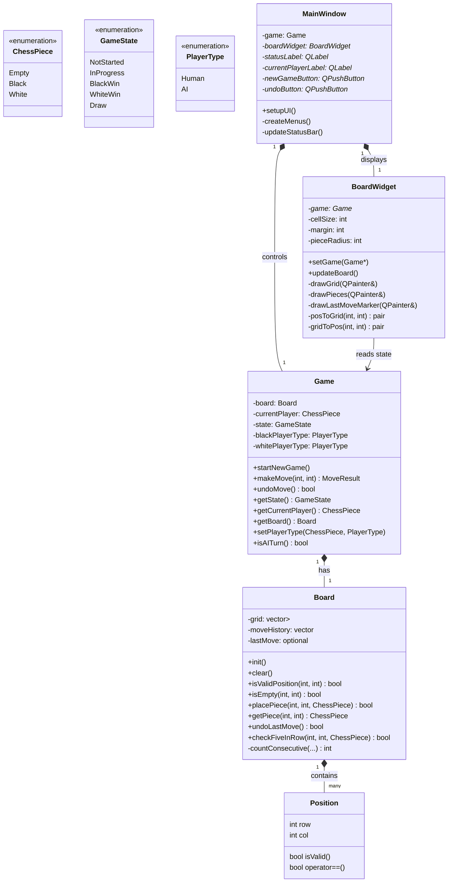
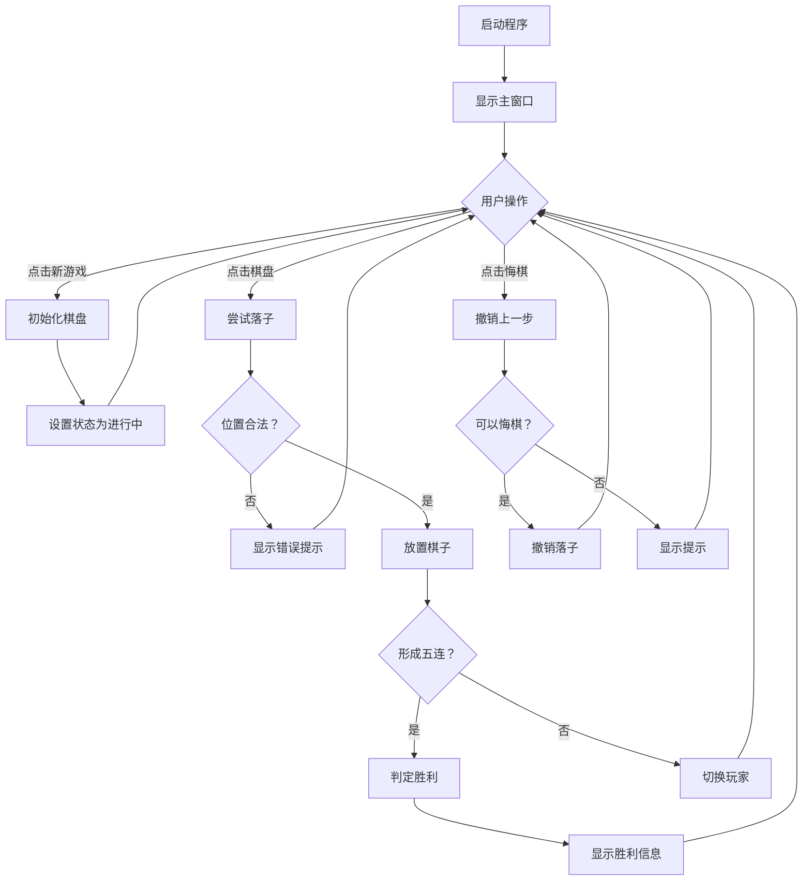
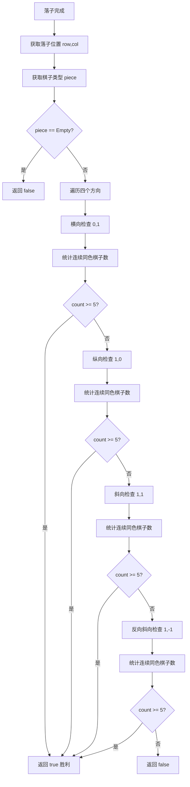
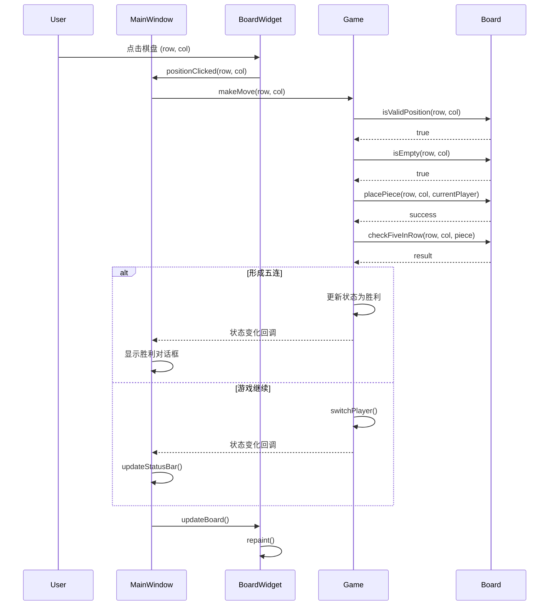

# 五子棋软件设计文档

## 1. 软件需求说明

### 1.1 项目背景

本项目是《软件设计》课程的实践项目，目标是开发一个具有完整可视化界面的五子棋桌面应用程序。通过该项目，实践软件工程的完整开发流程，包括需求分析、系统设计、编码实现、测试验证和文档编写。

### 1.2 功能需求

#### 1.2.1 核心功能

| 编号 | 功能 | 描述 | 优先级 |
|------|------|------|--------|
| F01 | 开始游戏 | 用户可以开始新的对局 | P0 |
| F02 | 双人对战 | 支持两名玩家在同一设备上轮流下棋 | P0 |
| F03 | 棋盘显示 | 显示 15×15 的标准棋盘 | P0 |
| F04 | 棋子显示 | 正确显示黑白两种棋子 | P0 |
| F05 | 鼠标落子 | 通过鼠标点击在交叉点落子 | P0 |
| F06 | 合法性检查 | 阻止在无效位置或已有棋子位置落子 | P0 |
| F07 | 回合切换 | 黑白双方自动轮流下棋 | P0 |
| F08 | 胜负判断 | 正确识别五子连珠并判定胜负 | P0 |
| F09 | 游戏结束 | 获胜后禁止继续落子 | P0 |
| F10 | 重新开始 | 清空棋盘，开始新对局 | P0 |
| F11 | 悔棋 | 撤销最后一步棋 | P1 |
| F12 | 状态显示 | 显示当前玩家和游戏状态 | P1 |

#### 1.2.2 界面需求

| 编号 | 功能 | 描述 | 优先级 |
|------|------|------|--------|
| UI01 | 主窗口 | 具有菜单栏和控制面板的主窗口 | P0 |
| UI02 | 棋盘控件 | 可交互的棋盘显示区域 | P0 |
| UI03 | 按钮控件 | 新游戏、悔棋等操作按钮 | P0 |
| UI04 | 状态栏 | 显示游戏状态和当前玩家 | P1 |
| UI05 | 菜单系统 | 文件、游戏、帮助菜单 | P1 |
| UI06 | 视觉反馈 | 最后一步标记、棋子渐变效果 | P2 |

### 1.3 非功能需求

- **性能**: 落子响应时间 < 100ms
- **兼容性**: 支持 Windows 10/11、macOS、Linux
- **可维护性**: 代码具有清晰的注释和模块化结构
- **可扩展性**: 预留 AI、网络对战等扩展接口

---

## 2. 类图设计

### 2.1 核心类图



### 2.2 类职责说明

| 类名 | 职责 | 关键方法 |
|------|------|----------|
| `Board` | 管理棋盘状态、处理落子、判断胜负 | `placePiece()`, `checkFiveInRow()` |
| `Game` | 控制游戏流程、玩家切换、状态管理 | `makeMove()`, `undoMove()`, `startNewGame()` |
| `BoardWidget` | 绘制棋盘和棋子、处理鼠标事件 | `paintEvent()`, `mousePressEvent()` |
| `MainWindow` | 整合 UI 组件、响应用户操作 | `onNewGame()`, `onUndo()`, `onPositionClicked()` |

---

## 3. 流程图

### 3.1 游戏主流程



### 3.2 胜负判断流程



---

## 4. UML 时序图

### 4.1 落子交互时序图



---

## 5. 测试报告

### 5.1 测试环境

| 项目 | 配置 |
|------|------|
| 操作系统 | Windows 11 64-bit |
| Qt 版本 | Qt 6.5.0 MinGW 11.2.0 64-bit |
| 编译器 | GCC 11.2.0 |
| CMake | 3.24.0 |

### 5.2 功能测试结果

| 测试用例 | 预期结果 | 实际结果 | 状态 |
|----------|----------|----------|------|
| TC01-空棋盘显示 | 显示 15×15 空棋盘 | 符合预期 | ✅ |
| TC02-黑方第一手 | 成功落子 | 符合预期 | ✅ |
| TC03-重复落子 | 阻止并提示 | 符合预期 | ✅ |
| TC04-边界落子 | 成功落子 | 符合预期 | ✅ |
| TC05-中央落子 | 成功落子 | 符合预期 | ✅ |
| TC06-横向五连 | 判定黑方胜 | 符合预期 | ✅ |
| TC07-纵向五连 | 判定白方胜 | 符合预期 | ✅ |
| TC08-斜向五连 | 判定胜利 | 符合预期 | ✅ |
| TC09-六子连珠 | 判定胜利 | 符合预期 | ✅ |
| TC10-四连非五连 | 继续游戏 | 符合预期 | ✅ |
| TC11-黑白交替 | 正确切换 | 符合预期 | ✅ |
| TC12-胜利后落子 | 阻止并提示 | 符合预期 | ✅ |
| TC13-重新开始 | 棋盘清空 | 符合预期 | ✅ |
| TC14-悔棋功能 | 撤销成功 | 符合预期 | ✅ |
| TC15-窗口关闭 | 正常退出 | 符合预期 | ✅ |

### 5.3 性能测试

| 测试项 | 指标 | 结果 |
|--------|------|------|
| 启动时间 | < 2 秒 | ~0.8 秒 |
| 落子响应 | < 100ms | ~15ms |
| 重绘帧率 | > 30fps | ~60fps |
| 内存占用 | < 50MB | ~25MB |

---

## 6. 项目分工说明

| 成员 | 角色 | 负责模块 | 工作量占比 |
|------|------|----------|------------|
| [姓名待填] | 项目负责人 | Game 类、Board 类、整体架构 | 35% |
| [姓名待填] | UI 开发 | MainWindow、BoardWidget、界面设计 | 35% |
| [姓名待填] | 测试与文档 | 测试用例、文档编写、QA 验证 | 30% |

**注意**: 提交前请补充真实组员姓名和工作分工

---

## 7. 开题/中期/答辩展示要点

### 7.1 开题展示

1. **项目背景**: 五子棋游戏的文化背景和教学意义
2. **需求分析**: 功能需求和非功能需求
3. **技术选型**: C++ Qt 的优势分析
4. **开发计划**: 时间表和里程碑

### 7.2 中期展示

1. **已完成功能**: 核心游戏逻辑、基础 UI
2. **架构设计**: 分层架构和类图说明
3. **技术难点**: 胜负判断算法、Qt 绘图优化
4. **后续计划**: 剩余功能和优化方向

### 7.3 最终答辩

1. **完整演示**: 现场运行程序展示全部功能
2. **设计亮点**: 
   - 数据与显示分离的架构
   - 高效的胜负判断算法
   - 良好的用户体验设计
3. **创新点**: 
   - 最后一步高亮标记
   - 响应式棋盘大小调整
   - 逼真的棋子渲染效果
4. **代码质量**: 注释规范、模块化设计、可扩展性

---

## 8. 附录

### 8.1 编译命令速查

```bash
# 创建构建目录
mkdir build && cd build

# 配置 CMake
cmake -DCMAKE_PREFIX_PATH="C:/Qt/6.5.0/mingw_64" ..

# 编译
cmake --build .

# 运行
./Gomoku
```

### 8.2 关键算法说明

**胜负判断算法核心思路**:
- 对于每次落子，只需检查经过该落子位置的四个方向
- 每个方向统计连续同色棋子数量（包含正反两个方向）
- 任意方向达到 5 子即判定胜利
- 时间复杂度：O(1)，因为棋盘大小固定且只检查四个方向

### 8.3 参考资料

1. Qt 官方文档：https://doc.qt.io/
2. C++17 标准参考
3. 五子棋规则说明
4. 软件工程课程设计指南

---

**文档版本**: 1.0  
**最后更新**: 2026-08-28
